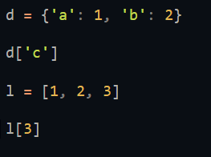
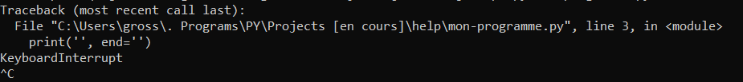

# Aide sur les implémentation par défaut de python

Certaines fonctionnalitées ne son pas très utiles / trop complexes donc il n'y a que les erreurs les plus importantes ici.

Je m'excuse d'avance pour les fautes d'orthographes.

**Tout texte grisé avec un # devant est un commentaire**


---------------------


## Mots clés


#### `for`

Pour créer une boucle qui s'arrêtera forcément.
En français ça donne:

```
Pour variable du début de l'objet jusqu'à la fin de l'objet:
	faire quelque chose ...
```

Exemples:

```python
for i in range(3):
	print(i)
# affiche:
# 0
# 1
# 2


for x in [1, 2, 3]:
	print(i)
# affiche:
# 1
# 2
# 3
```


#### `return`

Pour que la fonction retourne quelque chose.

```python
def fonction():

	...

	return ...


def add(a, b):
	return a + b


x = add(2, 3) # x = 5

print(add(2, 3)) # affiche 5
```


#### `while`

Pour créer un boucle avec un objectif déterminé
En français ça donne:

```
Tant que "objectif" n'est pas réalisé:
	faire quelque chose
```

Exemples:

```python
i = 0

while i < 10:
	i = i + 1

print('fini !', i)
# affiche "fini ! 9"
# quand la boucle est terminé


liste = []

# tant que taille de la liste est
# inférieure à 10
while len(liste) < 10:
	# ajoute 1 à la liste
	liste.append(1)
```


#### `if` / `elif` / `else`

```python

nombre = int(input('entrer un nombre: '))

if nombre <= 10: # SI inférieur ou égal à 10
	print('première condition')
elif nombre % 2 == 0: # SINON SI multiple de 2
	# donc 'elif' est l'équivalent d'un SINON mais avec une condition
	print('deuxème condition')
else: # SINON
	print('troisième condition')
```

Execution:

```
>>> entrer un nombre: 5
première condition
>>>
>>> entrer un nombre: 12
deuxième condition
>>>
>>> entrer un nombre: 33
troisième condition
```


#### `in` / `not`

```python

liste = [1, 2, 3]

print(1 in liste) # est ce que 1 est dans la variable liste
# affiche True donc Vrai

print(4 in liste) # est ce que 4 est dans la variable liste
# affiche False donc Faux

print(5 not in liste) # est ce que 5 n'est pas dans la variable liste
# affiche True donc Vrai


# not -> inverse la condition
# il peut être remplacer par '!=' (différent de)
print(3 != 2)
# affiche True

print(3 == 3 == 4)
# affiche False

```


#### `pass`

Fait rien du tout ('passe')


#### `def` / `lambda`

Définition de fonctions

```python
# définition plus compréhenssible pour du code complexe
def fonction():
	return 0


# définition rapide pour des petites opérations
fonction = lambda: 0

# c'est deux fonction sont les même en tous points
```

Exemples:

```python
def fonction_add(a, b):
	return a + b


lambda_add = lambda a, b: a + b

print(fonction_add(2, 2))
# affiche 4

print(lambda_add(2, 2))
# affiche 4
```


---------------------


## Operateur


#### `+` / `-`

Plus / Moins

```python
print(2 - 3)
# affiche -1
```


#### `/`

Division

```python
print(3 / 2)
# affiche 1.5
```


#### `*`

Multiplication

```python
print(2 * 2)
# affiche 4
```


#### `//`

Division sans reste

```python
print(5 // 2)
# affiche 2 car 2 * 2 = 4
```


#### `%`

Modulo -> retourne le reste de la division.

```python
print(5 % 2)
# affiche 1 car c'est le reste de 5 / 2
```

#### `**`

Puissance

```python
print(3 ** 2)
# affiche 9 car 3² = 9
```


#### `==`

Egal à

```python
print(2 * 2 == 4)
# affiche True
```

#### `!=`

Différent de

```python
print(2 != 3)
# affiche True
```

#### `<` / `>`

Inférieur / Supérieur

```python
print(4 < 7 > 6)
# affiche True
```


#### `<=` / `>=`

Inférieur ou égal / Supérieur ou égal

```python
print(3 <= 3)
# affiche True
```


#### `+=` / `-=` / `*=` / `/=` / `//=` / `%=` / `**=`

Redéfinition de variable avec opérateur

```python
a = 10

a += 10 # équivalent de "a = a + 10"
print(a)
# affiche 20

a -= 2 # équivalent de "a = a - 2"
print(a)
# affiche 18

a *= 2 # équivalent de "a = a * 2"
print(a)
# affiche 36

a /= 4 # équivalent de "a = a / 4"
print(a)
# affiche 9.0

a //= 2 # équivalent de "a = a // 2"
print(a)
# affiche 4.0

a %= 3 # équivalent de "a = a % 3"
print(a)
# affiche 1

a **= 3 # équivalent de "a = a ** 3"
print(a)
# affiche 1 (1 ** 3 = 1 * 1 * 1 = 1)
```

---------------------


## Fonctions

#### `print`

ça c'est facile quand même. :)


#### `input`

j'espère que vous savez ce que c'est.
Et comment ça fonctionne :)


#### `open`

Ouvre le fichier demander dans le mode passé en argument: `open(fichier, mode)`

Mode:
- `r` pour lire
- `w` pour écrire).

```python
fichier = open('programme.py', 'r')

print(fichier.read())
# afficher le contenu du fichier

fichier.close()
# ferme le fichier
```

#### `range`

Pour les boucles ou pour vérifier si un nombre appartient à une intervale: `range(debut, fin, pas)`

```python
for i in range(0, 10, 2):
	print(i)

# affiche:
# 0
# 2
# 2
# 6
# 8


for i in range(4, 0, -1):
	print(i)

# affiche:
# 4
# 3
# 2
# 1


print(2 in range(0, 10))
# affiche True car 2 appratient a l'intervale [0, 10[
```


#### `repr`

Retourne la réprésentation de l'objet passé en argument: `repr(objet)`

```python
print(repr(int))
# affiche: <class 'int'>

print(repr('test'))
# affiche: 'test'
```


#### `sorted`

Trie un conteneur ou une chaine de caractère: `sorted(variable, key)`

```python
print(sorted([3, 2, 1]))
# affiche: [1, 2, 3]

print(sorted('bca'))
# affiche: ['a', 'b', 'c']

print(sorted(
	[(1, 2), (2, 1)],
	key=lambda k: k[1]
))
# affiche: [(2, 1), (1, 2)]
```


#### `type`

Sert à récupérer le type d'un objet / variable quelconque: `type(variable)`

```python
print(type(1))
# affiche: <class 'int'>

print(type('hehe'))
# affiche: <class 'str'>

print(type([1, 2]))
# affiche: <class 'list'>
```


#### `len`

Retourne la longeur de la variable passée en argument: `len(variable)`

```python
print(len('salut'))
# affiche: 5

print(len([1, 2, 3]))
# affiche: 3


print(len({'a': 1, 'b': 2, 'c': 3}))
# affiche: 3
```


#### `max`

Retourne la valeur maximale de la variable passée en argument: `max(conteneur / nombres / texte)`

```python
ma_liste = [2, 8, 5, 2]
print(max(ma_liste))
# affiche: 8

print(max(4, 6, 2))
# affiche: 6

print(max('abc'))
# affiche: c
```


#### `min`

Fait le contraire de `max` donc retourne le minimum


#### `pow`

Equivalent de l'opérateur `**` mais sous forme de fonction.

```python
print(pow(4, 2))
# affiche: 16 (4 * 4)
```


#### `round`

Retourne de arrondi du nombre à x chiffre après la virgule: `round(nombre, x=0)`

```python
print(round(0.782))
# affiche: 1

pi = 3.14159265359
print(round(pi, 2)
# affiche: 3.14
```


#### `sum`
Retourne la somme de tous les nombres du conteneur.

```python
nombres = [1, 2, 3]
print(sum(nombres))
# affiche: 6

sum((-1, -2, 10))
# affiche: 7
```


#### `bin`

Transforme un nombre en binaire.
**Avec le préfixe `0b` à ignorer**

```python
print(bin(2))
# affiche: 0b10

print(bin(-1))
# affiche: -0b1

print(bin(2 + 2))
# affiche: 0b100


# REMARQUE: Vous pouvez utiliser le préfixe 0b plus une séquence binaire pour reconvertir en chiffres:
print(0b1010)
# affiche: 10
```


#### `oct`

Transforme un nombre en octal.
**Avec le préfixe `0o` à ignorer**

```python
print(oct(10))
# affiche: 0o12

print(oct(99))
# affiche: 0o143


# REMARQUE: Vous pouvez utiliser le préfixe 0o plus une séquence octal pour reconvertir en chiffres:
print(0o143)
# affiche: 99
```


#### `hex`

Transforme un nombre en hexadécimal.
**Avec le préfixe `0x` à ignorer**

```python
print(hex(15))
# affiche: 0xf

print(hex(-4))
# affiche: -0x4


# REMARQUE: Vous pouvez utiliser le préfixe 0x ( bref vous avez compris :) )
print(0xf)
# affiche: 15
```


#### `chr`

Retourne le caractère dans la table d'encodage utilisée par rapport à l'index.

```python
print(chr(97))
# affiche: a
```


#### `ord`

`chr` mais dans le sens inverse.

```python
print(ord('a'))
# affiche: 97
```


#### `callable`

Retourne `True` si la variable passée en argument peut être appelée, sinon `False`.

```python
print(callable(chr))
# affiche: True

print(callable(2))
# affiche: False
```


#### `isinstance`

Retourne `True` si la variable corespond au type donné, sinon `False`.

```python
mon_type = int
ma_variable = 2

print(isinstance(ma_variable, mon_type))
# affiche: True

print(isinstance('abc', int))
# affiche: False
```


#### `enumerate`

C'est compliquer à expliquer donc je met juste des exemples si vous avez des questions regardez sur google ou demander moi discord mais bon :( `Grosse pastèque#6705`.

```python
ma_liste = ['a', 'b', 'c']

for index, valeur in enumerate(ma_liste):
	print(index, valeur)

# affiche:
# 0 a
# 1 b
# 2 c

# la valeur "a" correspond à l'index 0 dans ma_liste, ect...
```


#### `eval`

Retourne l'évaluation d'une seule ligne de code.
```python
code = "1 + 1"
print(eval(code))
# affiche: 2

code = "'a' + 'b'"
print(eval())
# affiche: ab
```


#### `exec`

Execute du code

```python
exec("print('salut')")
# affiche: salut
```


#### `exit`

Quite le programme.

```python

print('début')

exit()

print('fin')
```

Affiche:
```
début
```

Car on à quiter le programme avant d'executer `print('fin')`


#### `dir`

Retourne toutes les fonctionnalitées d'une variable.
C'est fonctionnalitées peuvent être executer comme l'exemple si dessous.

```python
ma_liste = [3, 2, 1]

print(dir(ma_liste))
# affiche une liste de PLEIN de fonctionnalitées dont "append"
# preuve:

print("append" in dir(ma_liste))
# affiche: True

# donc on peut faire:
ma_liste.append(0)
```


#### `help`

Vous affiche une aide pour une variable / objet.
**Je vous conseille d'utiliser cette fonction si vous comprenez bien l'anglais**

```python
help(int)
# ...


help('aide pour du texte')
# ...
```


#### `globals`

Renvoie un dictionnaire contenant toute les variables, fonctions, ... de votre programme.

```python
a = 2

print('a' in globals())
# affiche: True

print(globals()['a'])
# affiche: 2
```


---------------------


## Types de variables

***Pour récupérer le type d'une valeur: `type(variable)`***

#### `bool`

`True` ou `False`

```python
print(bool(1))
# affiche: True

print(bool(0))
# affiche: False

print(bool([1, 2, 3, ...]))
# affiche: True

print(bool([]))
# affiche: False

print(bool(""))
# affiche: False

print(bool("salut"))
# affiche: True

```

- **Tous conteneur vide est `False`**
- **Tous nombre diférent de `0` est `True`**
- **Toutes chaine de caratère vide est `False`**


#### `dict`

Dictionnaire

```python
d = {'a': 1, 'b': 2, 'c': 3}

variable_a_convertir = [('index': 'valeur'), (1, 'a')]

print(dict(variable_a_convertir))
# affiche: {'index': 'valeur', 1: 'a'}
```


#### `float`

`0.1`, `-0.5`, Tous nombre décimal.


#### `int`

`1`, `-2`, `287`, Tous nombre entier.


#### `list`


```python
liste = [1, 2, 3]
print(liste[-1])
# affiche: 3

print(liste[-2]) # dernière valeur -1 donc avant dernière valeur
# affiche: 2

print(list('abc'))
# affiche: ['a', 'b', 'c']
```


#### `str`

Chaine de caractères.
`"salut"`, `'c\'est moi`, `""" ;) """`

__**ATTENTION: Guillemets simple `'` et double `"` C'EST LA MÊME CHOSE !**__


#### `tuple`

Les tuples ne peuvent pas êtres modifier ou peut juste récupérer les valeurs qu'ils contiennent.

```python
t = (1, 2, 3)

print(t[0])
# affiche: 1

t[1] = 2
# erreur
```


---------------------


## Erreurs

Ou ce trouve le nom de l'erreur quand elle apparaît ?


| Encadré en: | représentation |
|-------------|------|
| *jaune*	  | fichier ou l'erreur est survenue |
| *rouge*	  | ligne à laquel l'erreur est survenue |
| *orange*	  | code qui à causé l'erreur |
| *vert*	  | **nom de l'erreur** |
| *bleu*	  | rapport de l'erreur |


#### `FileExistsError`

Quand vous essayez de créer un fichier qui existe déjà.


#### `FileNotFoundError`

Quand vous essayez 'douvrir un fichier qui n'existe pas.


#### `ImportError` / `ModuleNotFoundError`

Quand vous essayez d'importer un module / fichier qui n'existe pas ou qui est introuvable.


#### `IndentationError` / `TabError`

Quand votre indentation / vos tabulations est fause.


#### `IndexError` / `KeyError`

Quand vous essayez de récupérer un index qui n'est pas dans le conteneur.




#### `KeyboardInterrupt`

Quand vous fermez de force un programme avec `Ctrl + c`.




#### `NameError`

Quand vous essayer d'utiliser un variable non définie.


#### `PermissionError`

Quand vous essayer d'accéder à un dossier / fichier que python ne peut pas ouvrir.


#### `SyntaxError`

N'importe quelle erreur de syntaxe python.


#### `TypeError`

Erreur de type de variable.


#### `ZeroDivisionError`

Quand vous essayer de diviser un nombre par 0.


<details>
	<summary>;)</summary>
	Enfin finis c'téait long mais bon j'espère que ça vous aidera :D
</details>
