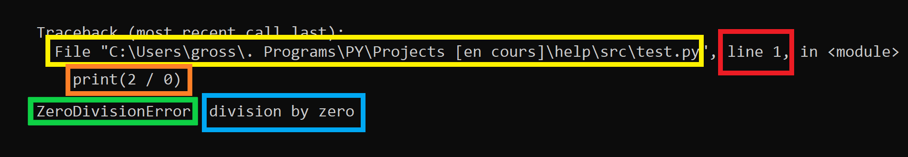
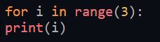
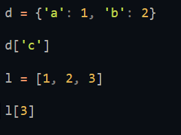
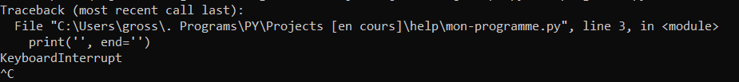
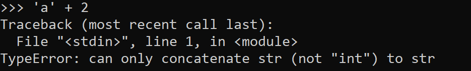

# Aide sur les implémentation par défaut de python

Certaines fonctionnalités ne son pas très utiles / trop complexes donc il n'y a que les erreurs les plus importantes ici.


## Mots clés

#### *for*
Pour créer une boucle avec arrêt
```python
for i in ...:
	...


for i in range(3):
	...


for x in [1, 2, 3]:
	...
```

#### *return*
Pour que la fonction retourne quelque chose
```python
def fonction():

	...

	return ...


def add(a, b):
	return a + b


x = add(2, 3) # x = 5

print(add(2, 3)) # affiche 5
```

#### *while*
Boucle avec condtion
```python
while condition:
	...


liste = []
while len(liste) < 10:
	liste.append(1)
```

#### *if* / *elif* / *else*
Conditions
```python

nombre = int(input('entrer un nombre: '))

if nombre <= 10: # SI inférieur ou égal à 10
	print('première condition')
elif nombre % 2 == 0: # SI multiple de 2 et SI supérieur a 10
	# donc 'elif' est l'équivalent d'un SINON mais avec une condition
	print('deuxème condition')
else: # SINON
	print('troisième condition')
```
Execution:
```
>>> entrer un nombre: 5
première condition
>>>
>>> entrer un nombre: 12
deuxième condition
>>>
>>> entrer un nombre: 33
troisième condition
```

#### *in* / *not*
```python

liste = [1, 2, 3]

print(1 in liste) # est ce que 1 est dans la variable liste
# affiche True donc Vrai

print(4 in liste) # est ce que 4 est dans la variable liste
# affiche False donc Faux

print(5 not in liste) # est ce que 5 n'est pas dans la variable liste
# affiche True donc Vrai


# not -> inverse la condition
# il peut être remplacer par '!=' (différent de)
print(3 != 2)
# affiche True

print(3 == 3 == 4)
# affiche False

```

#### *pass*
Fait rien du tout ('passe')

#### *def* / *lambda*
Définition de fonctions
```python
# définition plus compréhenssible pour du code complexe
def fonction():
	return 0


# définition rapide pour des petites opérations
fonction = lambda: 0

# c'est deux fonction sont les même en tous points
```

Exemples:
```python
def fonction_add(a, b):
	return a + b


lambda_add = lambda a, b: a + b

print(fonction_add(2, 2))
# affiche 4

print(lambda_add(2, 2))
# affiche 4
```


## Fonctions

| Fonction 	 | Utilisation	| Exemples	|
|------------|--------------|-----------|
| *print*		 | ça c'est facile quand même. | :) |
| *input*		 | j'espère que vous savez ce que c'est. | et comment ça fonctionne :) |
| *open*		 | `open(fichier, mode)` (mode: `r` pour lire, `w` pour écrire). | `open('programme.py', 'r')` |
| *range*		 | `range(debut, fin, pas)` | `[i for i in range(0, 10, 2)] -> [0, 2, 4, 6, 8]`, `[i for in range(4, 0, -1)] -> [4, 3, 2, 1]` |
| *repr*		 | `repr(variable)` -> représentation de la variable. | `repr(int) -> <class 'int'>`, `repr('test') -> 'test'` |
| *sorted*	 | `sorted(variable, key)` -> variable triée. | `sorted([3, 2, 1]) -> [1, 2, 3]`, `sorted('bca') -> ['a', 'b', 'c']`, `sorted([(1, 2), (2, 1)], key=lambda k: k[1]) -> [(2, 1), (1, 2)]` |
| *type*		 | `type(variable)` -> type de la variable. | `type(1) -> <class 'int'>`, `type('hehe') -> <class 'str'>`, `type([1, 2]) -> <class 'list'>` |
| *len*		 | `len(variable)` -> taille de l'object. | `len('salut') -> 5`, `len([1, 2, 3]) -> 3`, `len({'a': 1, 'b': 2, 'c': 3}) -> 3` |
| *max*		 | `max(conteneur / nombres)` -> valeur maximale dans le conteneur. | `max([2, 8, 5, 2]) -> 8`, `max(4, 6, 2) -> 6` |
| *min*		 | `min(conteneur / nombres)` fait l'inverse de `max` donc renvoie la valeur minimale. | `min(2, 7, 9, -1) -> -1` |
| *pow*		 | `pow(nombre, puissance)` -> nombre a la puissance donnée. | `pow(2, 3) -> 8`, remarque, la puissance 0.5 est l'équivalente de la racine carré `pow(16, 0.5) -> 4` |
| *round*		 | `round(nombre, x=0)` arrondi le nombre à x chiffres après la virgule. | `round(0.782) -> 1`, `round(3.14159265359, 2) -> 3.14` |
| *sum*		 | `sum(conteneur)` fait la somme de tous les entier du conteneur donnés. | `sum([1, 2, 3]) -> 6`, `sum((-1, -2, 10)) -> 7` |
| *bin*		 | `bin(entier)` -> valeur en binaire de l'entier avec le préfixe `0b`. | `bin(2) -> '0b10`, `bin(-1) -> '-0b1'`, `bin(2 + 2) -> '0b100'` |
| *oct*		 | `oct(entier)` -> valeur en octal de l'entier avec le préfixe `0o`. | `oct(10) -> '0o12'`, `oct(99) -> 0o143` |
| *hex*		 | `hex(entier)` -> valeur en hexdécimal de l'entier avec le préfixe `0x`. | `hex(15) -> '0xf'`, `hex(-4) -> '-0x4'` |
| *chr*		 | `chr(entier)` -> lettre correspondant à l'entier dans la table des caractères. | `chr(97) -> 'a'` |
| *ord*		 | `ord(caractère)` -> numéro correspondant au caratère dans la table des caractères. (inverse de `chr`) | `ord('a') -> 97` |
| *callable*	 | `callable(variable)` -> True si la variable peut être appelée `variable()` sinon False. | `callable(chr) -> True`, `callable(2) -> False` |
| *isinstance* | `isinstance(variable, type)` -> True si le type de la variable correspont au type sinon False. | `isinstance(2, int) -> True`, `isinstance('hehe', list) -> False`, `isinstance([1, 2], (tuple, list)) -> True` |
| *enumerate*	 | `enumerate(conteneur (sauf dictionnaires))` dans une boucle renvoie les indexs des valeurs en plus. | `[(index, valeur) for index, valeur in enumerate(['a', 'b'])] -> [(0, 'a'), (1, 'b')]` |
| eval		 | `eval(code)` -> évalue une seule "ligne" de code et renvoie le résultat. | `eval("1 + 1 == 2") -> True`, `eval("'a' + 'b'") -> 'ab'` |
| *exec*		 | `exec(code)` execute le code donné. | `exec("print(0)") -> affiche 0` |
| *exit*		 | `exit()` -> quite le programme | `exit();print(1) -> print(1) ne sera jamais executé` |
| *dir*		 | `dir(variable)` -> donne toute les fonctions de la variable, c'est fonctions peuvent être utilisées comme ceci `variable.fonction()`. | `dir("texte") -> ['replace', pleins dautres fonctions]`, `"texte".replace('e', 'a') -> 'taxta'` |
| *help*		 | `help(variable)` donne une aide sur une fonctionnalité python, si vous préférer vous pouvez utiliser cette fonction au lieu de `dir` | `help(int) -> vous aide sur le type int donc les nombres` |
| *globals*	 | `globals()` -> dictionnaire de toutes les variables / objects de votre programme | ... |


## Types de variables

*Pour récupérer le type d'une valeur: `type(variable)`*

| Type 		| Exemples	|
|-----------|-----------|
| *bool*	| `True` / `False`, `bool(1) -> True`, `bool(0) -> False`, `bool([1, 2, 3, ...]) -> True`, `bool([]) -> False`, `bool("") -> False`, `bool("salut") -> True` **Tous conteneur vide est `False`, Tous nombre diférent de `0` est `True`, Toutes chaine de caratère vide est `False`.** |
| *dict*	| `{'a': 1, 'b': 2, 'c': 3, ...}` |
| *float*	| `0.1`, `-0.5`, Tous nombre décimal. |
| *int*		| `1`, `-2`, `287`, Tous nombre entier. |
| *list*	| `[1, 2, 3, ...]` |
| *set*		| `{1, 2, 3}`, Les sets trient automatiquement les valeur dans l'ordre `{2, 7, 6, 8} -> {2, 6, 7, 8}` |
| *str*		| `"salut"`, `'c\'est moi`, `""" ;) """` |
| *tuple*	| `(1, 2, 3, ...)` |


## Erreurs

Ou ce trouve le nom de l'erreur quand elle apparaît ?


| Encadré en: | représentation |
|-------------|------|
| *jaune*	  | fichier ou l'erreur est survenue |
| *rouge*	  | ligne à laquel l'erreur est survenue |
| *orange*	  | code qui à causé l'erreur |
| *vert*	  | **nom de l'erreur** |
| *bleu*	  | rapport de l'erreur |

#### *FileExistsError*
Quand vous essayez de créer un fichier qui existe déjà.

####  *FileNotFoundError*
Quand vous essayez 'douvrir un fichier qui n'existe pas.

####  *ImportError* / *ModuleNotFoundError*
Quand vous essayez d'importer un module / fichier qui n'existe pas ou qui est introuvable.

####  *IndentationError* / *TabError*
Quand votre indentation / vos tabulations est fause.


####  *IndexError* / *KeyError*
Quand vous essayez de récupérer un index qui n'est pas dans le conteneur.


####  *KeyboardInterrupt*
Quand vous fermez de force un programme avec `Ctrl + c`.


####  *NameError*
Quand vous essayer d'utiliser un variable non définie.

####  *PermissionError*
Quand vous essayer d'accéder à un dossier / fichier que python ne peut pas ouvrir.

####  *SyntaxError*
N'importe quelle erreur de syntaxe python.

####  *TypeError*
Erreur de type de variable.


####  *ZeroDivisionError*
Quand vous essayer de diviser un nombre par 0.